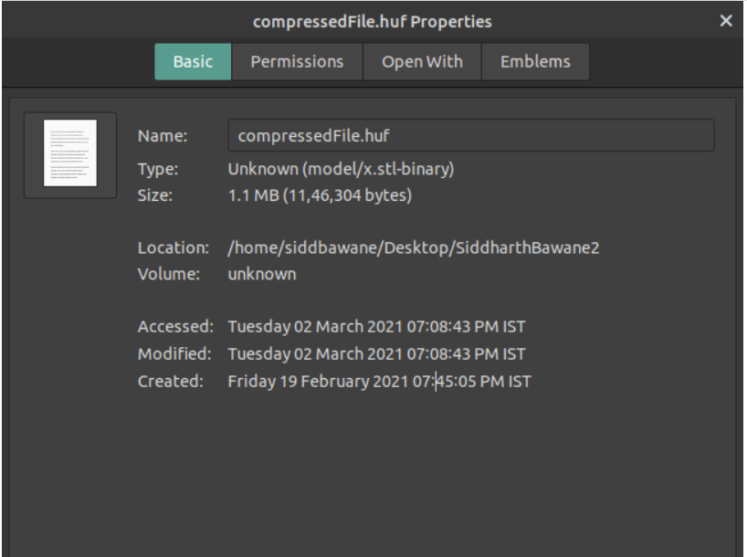

# File Compression Software

This project is based on Huffman Coding, a lossless, bottom-up compression algorithm. It can compress and decompress any text files.

## Project Implementation

This project supports two functions:

1. Encode: This function Compresses input file passed.
2. Decode: This function Decompresses Huffman coded file passed back to its original file.

## Documentation

To run this project you need to create an executable file. You can follow the steps given below:

#### 1. For Compressing:

Open terminal and run the following commands

`g++ encode.cpp huffman.cpp -o main`

`./main inputFile.txt compressedFile.huf`

#### 2. For Decompressing:

Open terminal and run the following commands

`g++ decode.cpp huffman.cpp -o main`

`./main compressedFile.huf outputFile.txt`

## Demo

#### Result:

Example: inputFile.txt (2.2MB) is compressed to compressedFile.huf (1.1MB) file and decompressed back to ouputFile.txt (2.2MB).

### Screenshots

Input File Size = 2.2 MB

Compressed File Size = 1.1 MB

Decompressed Output File Size = 2.2 MB

